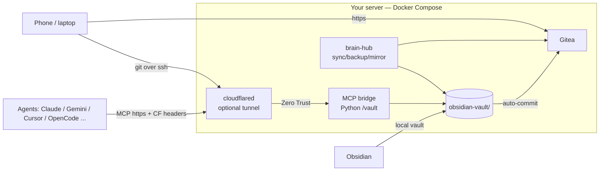

# Agent Brain · الذاكرة المركزية لوكلاء الذكاء الاصطناعي

A self-hosted **central memory hub for AI agents** — one shared, versioned,
backed-up Obsidian vault that every agent you run (Claude Code, Gemini, Cursor,
OpenCode, Kimi…) reads and writes over MCP, reachable from any device through
Cloudflare Zero Trust.

```text
فكرة المشروع: ذاكرة واحدة مشتركة لجميع وكلاء الذكاء الاصطناعي — منظمة،
مصحوبة بإصدارات Git، ونسخ احتياطي تلقائي، ووصول آمن من أي جهاز.
```

**Zero setup to be productive**: run one script, and you get a git-served
memory vault, an MCP gateway, automatic sync/backup/mirroring, and phone access.

---

## What it gives you

| Capability | How |
|---|---|
| Shared memory | Plain Markdown vault, read by Obsidian and by every agent |
| Versioned | Every change is auto-committed and pushed to Gitea every 15 min |
| Remote agents | MCP `streamable-http` bridge, authenticated via Cloudflare Access |
| Zero Trust | CF service-token headers re-validated at the bridge (defense in depth) |
| Automatic backups | Daily vault `git bundle` + Gitea data archive, pruned after N days |
| GitHub mirroring | Optional: mirror all your GitHub repos into Gitea (never deletes) |
| Phone / any device | Tunnel + MCP client, or `git clone` over SSH |

## Architecture



Four services (plus optional `cloudflared` via `--profile tunnel`):

| Service | Image | Role |
|---|---|---|
| `gitea` | `gitea/gitea:1.27` | vault & mirror repos |
| `mcp-bridge` | local build (python:3.12) | MCP streamable-http, vault-locked tools |
| `brain-hub` | local build (alpine) | scheduler: sync 15m, backup 12h, mirror 4h |
| `cloudflared` | `cloudflare/cloudflared` | optional remote tunnel (profile) |

## Quickstart

Requires Docker + the Compose plugin.

One-liner (creates `agent-brain/` in the current directory):

```bash
curl -fsSL https://raw.githubusercontent.com/ai-balla/agent-brain/main/setup.sh | bash
```

Safer two-step (recommended — read it before you run it):

```bash
curl -o setup.sh https://raw.githubusercontent.com/ai-balla/agent-brain/main/setup.sh
bash setup.sh
```

The script prompts for a public hostname, writes `.env`, seeds the vault,
starts the stack and prints a hand-off sheet (endpoints + tokens + client
snippets). It is idempotent — re-run any time (e.g. after adding Cloudflare
credentials to `.env`).

### Then, for remote access
1. Cloudflare Zero Trust → Access → Service Auth → create a **Service Token**
   → paste `CF_ACCESS_CLIENT_ID` / `CF_ACCESS_CLIENT_SECRET` into `.env`.
2. Create a **Named Tunnel** (Access requires it), put its token in `TUNNEL_TOKEN`.
3. `docker compose --profile tunnel up -d`
4. Create an **Access application** protecting `https://<domain>/mcp`
   (provider: Service Auth; policy grants the service token).
5. Re-run `bash setup.sh` to print the client snippets, or see
   [`client/mcp-snippets.md`](client/mcp-snippets.md).

Local-only users can keep `MCP_ALLOW_NO_AUTH=true` and skip the tunnel — but
never expose the MCP port publicly in that mode.

### Secrets policy
- All credentials live in `.env` (mode 600), never in the repo or the vault.
- The only secrets you must keep safe after install: the admin password (in
  `.env`) and the printed Gitea API token.

## Automation (brain-hub)

| Job | Interval | What it does |
|---|---|---|
| auto-sync | 15 min | commit vault changes, push to Gitea |
| backup | 12 h | vault `git bundle` + Gitea data tar → `./data/backups`, prune > 14 d |
| mirror | 4 h | GitHub repos → Gitea (opt-in via `GH_TOKEN`; never deletes) |
| health-check | every round | gitea reachability + vault/build state (logs in `./data/backups/logs/`) |

Tune intervals with `SYNC_INTERVAL`, `BACKUP_INTERVAL`, `MIRROR_INTERVAL`.

## Layout

```
agent-brain/
├── docker-compose.yml       # gitea + mcp-bridge + brain-hub + cloudflared
├── .env.example             # documented, empty vars
├── setup.sh                 # idempotent installer
├── uninstall.sh             # stop + remove data (careful!)
├── mcp-server/              # Python MCP bridge (streamable-http, CF re-auth)
├── brain-hub/               # scheduler + sync/backup/mirror/health scripts
├── seed/vault/              # 3-layer vault template + AGENTS.md rules
├── client/                  # per-app MCP snippets
├── sandbox/                 # example: run third-party MCP tools containerized
├── SECURITY.md              # threat model, scoping, hardening checklist
└── data/                    # runtime (git-ignored): vault, gitea, backups, audit
```

The vault structure every agent reads (`AGENTS.md`):

```
memory-logs/   raw chats & audit trail (one subfolder per agent)
projects/      verified specs & project notes
skills/        reusable verified workflows
```

## Security model
- All services bind `127.0.0.1`; nothing is exposed unless you add the tunnel.
- The bridge re-validates Cloudflare service-token headers on **every** tool
  call (empty CF vars + `MCP_ALLOW_NO_AUTH=false` → refuses to start).
- Every tool path is locked to the vault root.
- **Per-agent scopes** (`AGENT_SCOPES`): each service token is pinned to its
  own workspace subpath, optional read-only; `ENFORCE_SCOPES=true` denies
  unknown tokens (strict zero-trust).
- **Human-in-the-loop**: `WRITE_APPROVAL=true` stages `write_file` under
  `vault/_pending/<agent>/…` until a human moves it into place.
- **Audit trail**: every call appends an append-only line to
  `./data/audit/access.jsonl` (outside the vault — agents can't scrub it).
- Mirror script performs zero deletions (GitHub-side deletions are preserved
  locally; see the header comment in `brain-hub/scripts/github-mirror-sync.sh`).

Read the full model, the honest exposure assessment, and the hardening
checklist in [`SECURITY.md`](SECURITY.md).

## Roadmap (Augmented over time)
- [ ] Vector search / semantic memory (Qdrant already runs on our host — wired
      into the bridge in a later phase)
- [x] Per-agent service-token identity + scoped workspaces (`AGENT_SCOPES`,
      `ENFORCE_SCOPES`) with an append-only audit log and approval staging
- [ ] Web UI in the vault browser (bundled Obsidian-style editor)
- [ ] Importers for Google Takeout / Keep (see our earlier work) shipped as scripts

## License
MIT — see [LICENSE](LICENSE). Built from our production setup:
`ai-balla/agent-brain` (the "real hub" this template was extracted from).